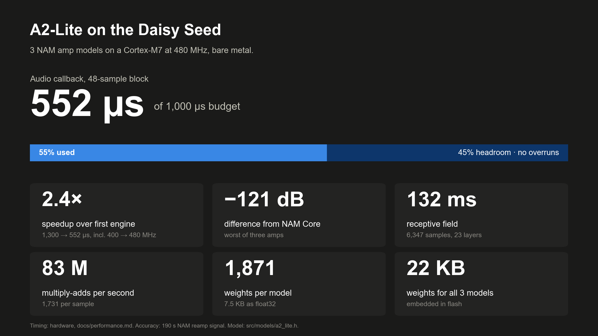
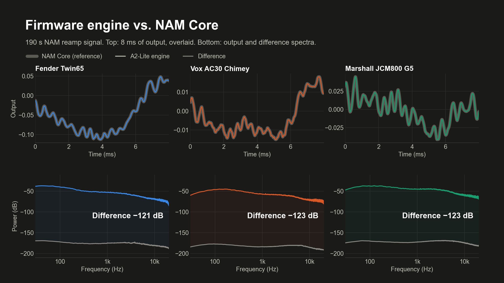
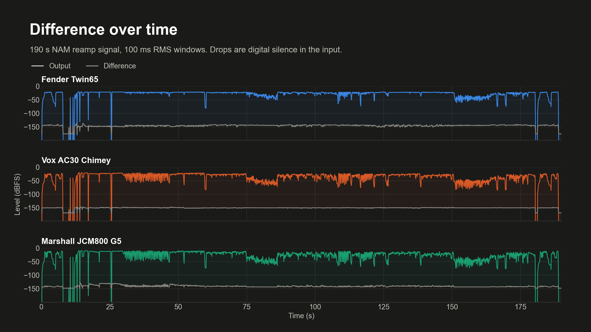
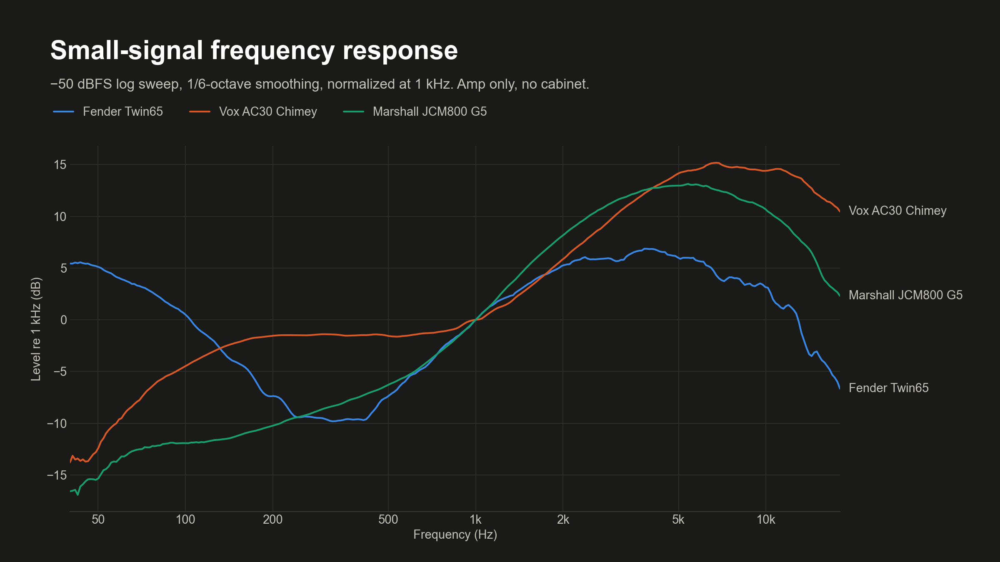
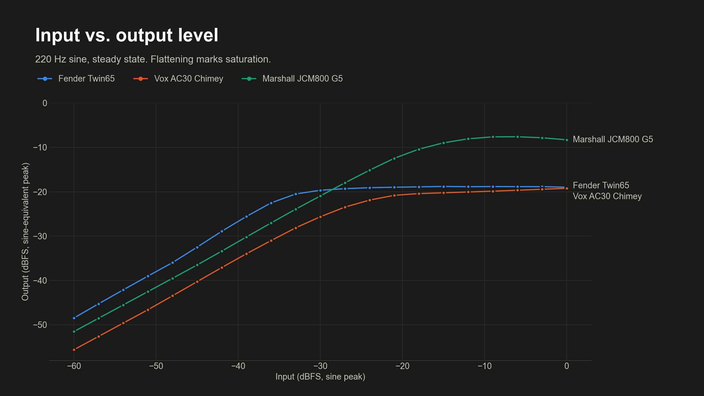
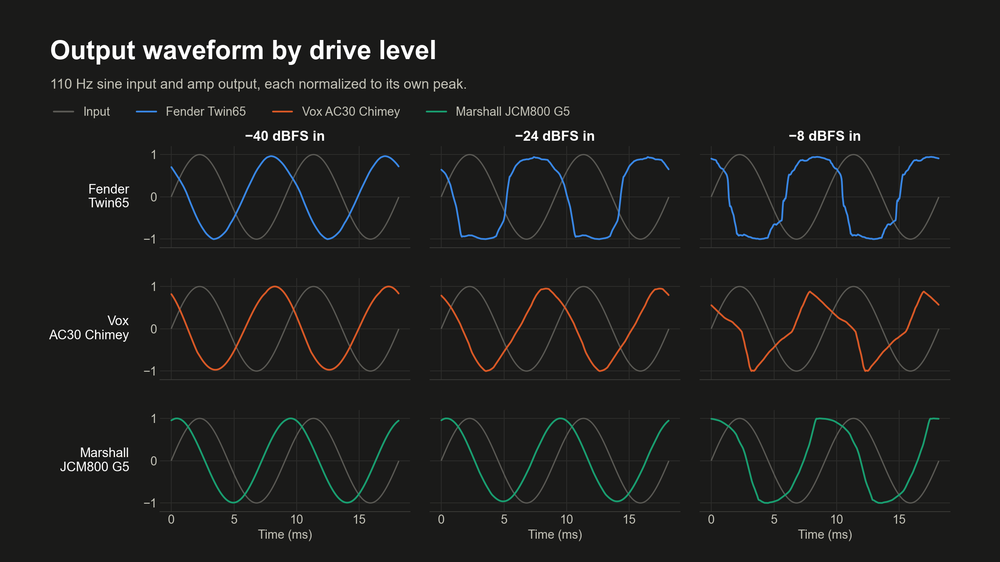
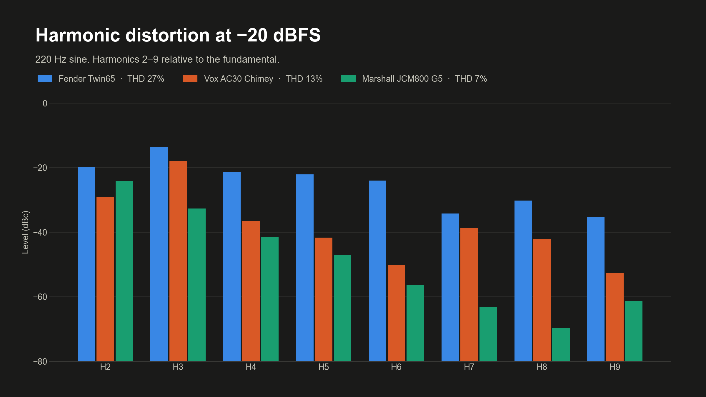

# NAM Seed3

Neural amp modeling on the Daisy Seed3 using libDaisy, with three A2-Lite models:
Fender '65 Twin Reverb, Vox AC30 Chimey, and Marshall JCM800 (gain 5).



The callback time is measured on the Seed (see [docs/performance.md](docs/performance.md));
the other numbers come from the model's shape and the accuracy renders below.

## Setup

On macOS, install [Homebrew](https://brew.sh) and Apple's Command Line Tools
(`xcode-select --install`). On Ubuntu, the installer uses `apt-get` and requests
`sudo` access when needed. Run from the repository root:

```sh
bash scripts/install.sh
bash scripts/download_models.sh
make
```

`make install` runs the same installer, and `make download-models` runs the
download script. It installs the ARM compiler and DFU
uploader, then fetches pinned versions of libDaisy and NAM Core. The download script saves the three
Tone3000 models to Git-ignored `models/local/`. The build embeds their weights
in the firmware. On Ubuntu, the installer also installs the build and download
prerequisites, including the ARM C/C++ libraries and Python 3.

## Upload and play

```sh
make upload
make monitor
```

If this firmware is already running, `make upload` sends it `B` over USB
serial and it reboots into DFU mode on its own. Otherwise (first flash, other
firmware, or a hung board), hold **BOOT**, press and release **RESET**, then
release **BOOT** to enter DFU mode before running `make upload`.

The firmware starts with Fender selected. Press a key in the serial monitor
to switch models or bypass; no Enter is needed:

| Key | Selection |
| --- | --- |
| `0` | Clean bypass |
| `1` | Fender '65 Twin Reverb |
| `2` | Vox AC30 Chimey |
| `3` | Marshall JCM800 (gain 5) |
| `B` | Reboot into DFU mode for flashing |

Audio runs at 48 kHz, with the left input processed and sent to both outputs.
Switching models or toggling bypass briefly interrupts playback. These are
amp-only models; cabinet filtering and hardware gain calibration are not implemented.

If multiple serial ports are connected, use `make monitor PORT=/dev/cu.usbmodem…`.
Exit the monitor with **Ctrl-A**, then **K**, then **Y**.

### Serial status

The firmware prints one status line per second:

```
--- NAM A2-Lite | 48-sample blocks @ 48 kHz | budget 1000 us/block | keys: 0=bypass 1=Twin65 2=AC30 3=JCM800 B=DFU ---
[active Fender Twin65          ]  avg  55% ( 552 us)  peak  56% ( 562 us)  headroom   438 us  blocks 1000  overruns 0
>>> bypass
[bypass -                      ]  avg   0% (   3 us)  peak   0% (   3 us)  headroom   997 us  blocks 1000  overruns 0
```

| Field | Meaning |
| --- | --- |
| `[mode amp]` | `active` with the running model, `bypass`, or `failed` if the model did not load (audio is bypassed). |
| `avg` | Mean audio-callback time over the last second, as a percentage of the block budget and in microseconds. |
| `peak` | Longest single callback over the last second. |
| `headroom` | Budget minus peak: how much slower the callback could get before an overrun. Negative means an overrun happened. |
| `blocks` | Callbacks in the last second (1000 at 48 samples per block and 48 kHz). |
| `overruns` | Callbacks that exceeded the budget in the last second. Lines with overruns are marked `<-- OVERRUN`. |

The header repeats every 20 lines, and `>>>` lines record model switches and
bypass. Bypass skips the model and passes the input straight through, so the
load drops to a few microseconds; leaving bypass reloads the selected model.
All three models share one architecture and cost the same.

## Results

These figures are rendered on the host by `make viz`, from the same engine source
the firmware runs. The accuracy figures use NAM's standard reamp signal when it
is at `models/local/reamp_signal.wav`, and a synthetic guitar DI otherwise.

### Accuracy

The firmware engine matches upstream NAM Core to within float rounding: the
difference is 121–123 dB below the output for every amp.



The difference stays at that level across the whole 190 s reamp signal.



### The three amps

Small-signal frequency response of each capture, without a cabinet.



Output level against input level. All three saturate well before full scale;
the Twin capture is cranked and breaks up first.



A 110 Hz sine at three drive levels, showing how each amp clips.



Harmonics 2–9 of a 220 Hz sine at −20 dBFS input.



## Development

| Command | Purpose |
| --- | --- |
| `make` | Build firmware and embed all three models. |
| `make test` | Compare against upstream NAM and run sanitized host audio tests. |
| `make viz` | Render the figures above to `build/viz/` (sets up `.venv/` on first run). |
| `make viz-docs` | Render the figures and copy them to `docs/images/`. |
| `make clean` | Remove build outputs; keep downloaded models and dependencies. |
| `make format` | Format C/C++ source in `src/` and `tests/`. |
| `make compiledb` | Generate the clangd compilation database. |
| `make help` | List commands. |

Formatting and clangd setup require `brew install clang-format compiledb`.
Host tests require a C++20 compiler.

See [docs/performance.md](docs/performance.md) for measured speedups, where
the time goes, and rejected experiments. `make upload PROFILE=1` prints
per-layer cycle counts.
